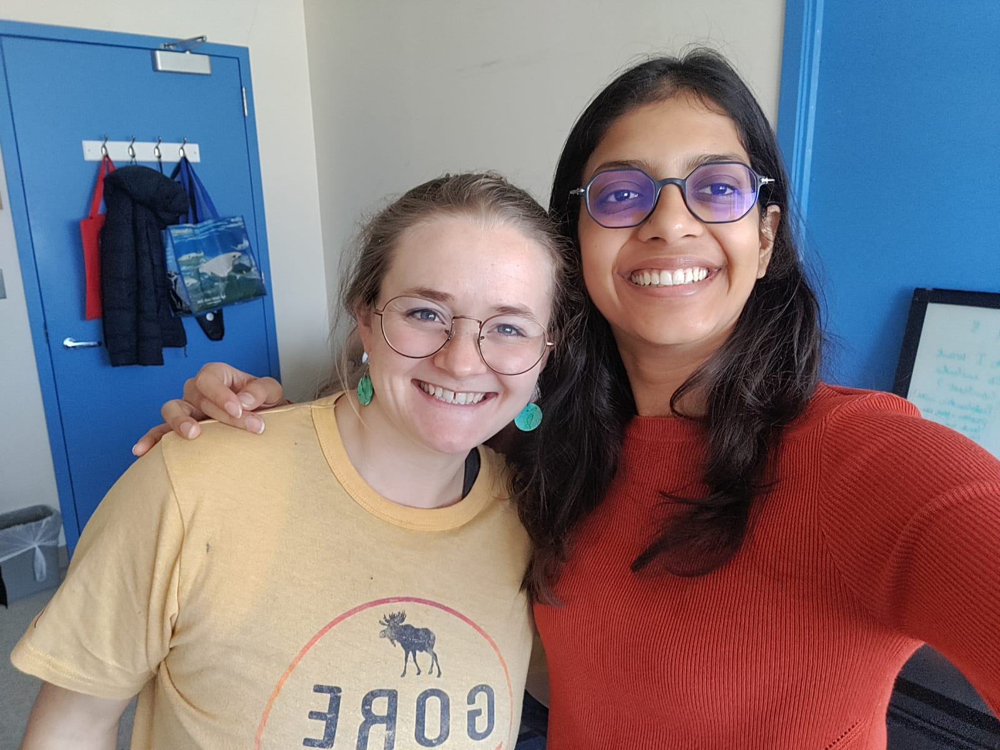

```{r setup, include=FALSE}
knitr::opts_chunk$set(echo = TRUE)
```

## Udita and Kathy's Github website

Udita Bansal https://github.com/bansal-udita 

Kathy Stenehjem https://github.com/kstenehjem 

<br>




